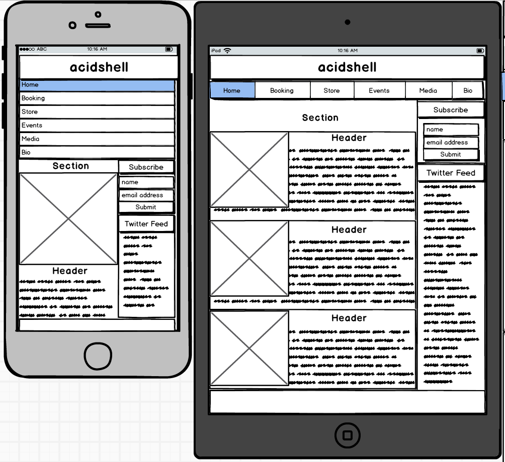
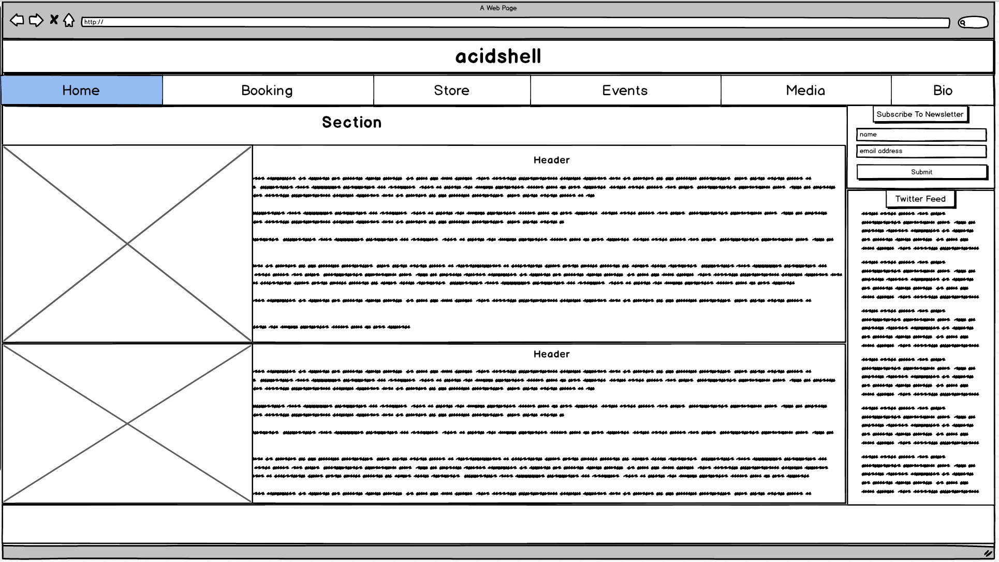

Stream1 - Frontend coding project 

Live link: 
https://cahilld.github.io/stream1project/
 
Purpose: 
* To create a backendless music page for my music profile showcasing a variety of webdesign skillsets and tools.
* Semantic HTML5 used as much as possible.

Needs it fulfils: 
* Ability for users to sign up to the artist newsletter, or book a gig using forms (as there is no backend this currently outputs to the screen using Java Script functions).
* Showcase musician profile, with centralised links to social media pages, shops, and online media.

Functionality: 
Needs to have a responsive design forusing on mobile first design. This has been accomplished using Bootstrap.

User Interface (UI): 
* Pages will load a separate navbar HTML page using W3's include script so Navigation bar can be adjusted in just one location, and dropped into each subsequent page. 
* Subscription link and social media links (including Twitter widget) will be on most pages in the Aside tag. I did not use the include script here as I did not feel all of these features should be on every page. 
* Initial landing page will contain all elements a user would need at a glance, and then a Bootstrap Navbar can be used to browse to subsequent pages. 
* I added an interactive image transition on the Bio page which rotates on hover to demonstrate transition effects. 

User Experience (UX): 
Logo: 
* Effect - I used a hue rotate transition on the main logo, cycled with CSS in an infinite loop to constantly rotate the hue of the image and then designed the image so there were different colours throughout it. 
* Scaling - Logo was manually designed and redrawn as an SVG then scaled to make the different resolution images, then rendered. Rescaling pngs was minimised as a result to only really small screens(below an iphone). 

Navigation Bar 
* Created using bootstrap and then customised using Hover CSS by Ian Lunn. This effect varies from mobile(Background with image) to desktop (without image). 

Carousel for images on the media page created using Jquery to cycle the images. Transparent background applied with black border to account for images with different aspect ratios. 
Users looking to buy music will be redirected to a variety of online retailers from the stores HTML page. 
Used a CSS saturation filter to pull down the saturation on the image on the main page. This was to balance the colour levels with the logo. 
Video embedded to the media page in MP4 format as this is supported by all major browsers according to W3 schools. 
Audio embedded into media page in mp3 only format as all browsers support mp3 so no need for ogg. 

Technologies used: 
* Javascript - For form submission. 
* JQuery - Used for the carousel. 
* Bootstrap 3 - Used but a lot of defaults were modified. 
* Twitter Widget - API not used, just the widget. 
* W3 Javascript - Used for creating an infinite loop to cycle hue. 
* W3 Include HTML - Used to create a standard navbar section. 
* Font Awesome - Used for some icons. 
* Github and Github Pages - Used to track the progress of the project, and host the site for submission without a backend. 
* Hover CSS by Ian Lunn (Licenced) 
* HTML5 
* CSS3 
* Cloud 9 - Used to code the project. 

Deployment method: Github Pages 
https://cahilld.github.io/stream1project/
 
  
Testing: 
No backend was used, so testing was done on multiple browsers, at different resolutions. 
Navbar 
* Gets imported to each page with all links directing to the appropriate pages using w3 Include. 
* Logo hue cycles at all resolutions using different resolution images for mobile devices hiding larger images or scaling depending on the resolution. 
* Hover CSS works as expected on hover both for mobile and desktop. 
* Stays on top using a high index value. 

Aside Sidebar 
* Social media links work in the aside bar for each page using appropriate colours for each company when hovered. 
* Twitter widget updates. 
* Subscribe functionality works but just prints to the screen using Javascript. 

Index page 
* Loads news section with image loading and working on all resolutions. 

Booking page 
* Booking form loads and prints input to screen using Javascript. 

Store page 
* Links to online retailers work with icons resized in accordance to their policies. 

Events page 
* Loads image and some sample information for music events with appropriate spacing and padding. 

Media page 
* Carousel cycles pictures automatically or when users click the appropriate arrows. A compromise had to be made with the size of the carousel due to the varying image dimensions. 
* Video plays when user clicks the play button. This is just a sample video to demonstrate the technology working. 
* Audio file plays. This is just a test file to demonstrate the functionality works. OGG file not included as all browsers support mp3 according to W3 schools. 
* Audio and video players dont show download button. 
* Audio and video players are the same width when scaled. 

Bio page 
* Logo animation works on hover. 
* Bio text displayed and spaced correctly. 
* Links embeded to tools used section where applicable, and highlight green when hovered. 
                 
Accreditation: 
* Video and some images were used from royalty free online resources. 
* Hover CSS licenced for use already. 

Mockup/Wireframe files which did change a lot since they was created due to learning new features with the technology: 
* Initial mockup for mobile and tablet devices: 

* Initial mockup for desktops: 

Requirements: 
* Create a website of around 4-5 pages. 
* Incorporate main navigation and grid layout. 
* Include at least one form with validation. Since you are not expected to build a backend for the project, all this form needs to do is inform the user of whether or not the data was submitted successfully (i.e. passed validation) 
* Whenever possible, strive to use semantic HTML5 elements to better structure your HTML code. 
* Make sure your site is as responsive as possible. You can test this by checking the site on different screen sizes and browsers. 
* The site should contain your own custom JavaScript logic – include at least one interactive component on your site that is based on non-trivial javascript logic. You can write this logic either inside an Angular controller/service, or in a separate js file. 
* You should conduct and document tests to ensure that all of you websites functionality works well. Automated testing using frameworks such as Jasmine are preferable, but properly documented manual tests are also acceptable. 
* Write a README.md file for your project (in Markdown format) that explains what the project does and the need that it fulfils. It should also describe the functionality of the project, as well as the technologies used. Detail how the project was deployed and tested and if some of the work was based off other code, explain what was kept and/or how it was changed to fit your need. A project submitted without a README.md file will FAIL. 
* In addition to the README.md file, you may include in your repository supplementary documentation and/or other relevant supporting material for the assessor in any format that is automatically handled by web browsers, such as html, pdf, jpg, etc. Files in proprietary formats such as Microsoft doc/docx will be ignored; but this is generally not a hindrance, since the vast majority of formats can be easily exported to PDF. 
* Use Git & GitHub for version control. Each new piece of functionality should be in a separate commit. 
* Deploy the final version of your code to a hosting platform such as GitHub Pages. 